<h1><strong>  API REST  - Restaurante 🧑🏽‍🍳 </strong></h1>

> Este é um projeto para a avaliação do final do Módulo 4 @ Resilia Educação.<br>

<div id="inicio" align=center>
<h2><strong>Status do Projeto</strong></h2>

  

</div> 

<h1>Sumario</h1>

- [2.0 - 📄 Documentação](#20----documentação)
  - [2.1 - Como executar o projeto](#21---como-executar-o-projeto)
  - [2.1.1 - Executando a API](#211---executando-a-api)
  - [2.1.2 - Executando a API localmente](#212---executando-a-api-localmente)
    - [2.1.2.1 - Requisitos](#2121---requisitos)
    - [2.1.2.2 - Como instalar as dependências do projeto](#2122---como-instalar-as-dependências-do-projeto)
  - [2.3 - Testando API](#23---testando-api)
  - [**Testando com Insomnia**](#testando-com-insomnia)
    - [Criando uma Collection](#criando-uma-collection)
  - [**Testando com Postman**](#testando-com-postman)
    - [Criando uma Collection](#criando-uma-collection-1)
  - [2.3 - Rotas possíveis e métodos](#23---rotas-possíveis-e-métodos)
  - [2.4 - Observações](#24---observações)
    - [🔗 Links úteis (inglês)](#-links-úteis-inglês)
- [2.5 - Requisitos do Projeto](#25---requisitos-do-projeto)
- [📌 1.0 - Task](#-10---task)
  - [1.1 - 🗝 Demandas do projeto](#11----demandas-do-projeto)
  - [1.2 - Extras](#12---extras)
  - [1.3 - Tecnologias](#13---tecnologias)
- [3. Desenvolvedores](#3-desenvolvedores)
  - [⬆ Voltar ao Topo](#-voltar-ao-topo)

## 2.0 - 📄 Documentação

### 2.1 - Como executar o projeto

### 2.1.1 - Executando a API
1. Utilize a  URL  para requisições:
```
https://restaurante-api-resilia.herokuapp.com/
```

1. Utilize as rotas no item <strong>2.3</strong> para acessar as informações, copiando a rota e colocando-a após a `/`
- Por exemplo:
`https://restaurante-api-resilia.herokuapp.com/cardapios/5`

### 2.1.2 - Executando a API localmente

#### 2.1.2.1 - Requisitos
- [VSCode](https://code.visualstudio.com/) ou outro editor de sua preferência
- Ter o [Node.js](https://nodejs.org/en/) instalado.
- Para testar as rotas da API utilize o [Postman](https://www.postman.com/) ou [Insomnia](https://insomnia.rest/) ou outra `plataforma de testes de API` da sua preferência. 

#### 2.1.2.2 - Como instalar as dependências do projeto
1. [Clone](https://www.youtube.com/watch?v=CisK8M3K0dI&ab_channel=Geofisicando) o repositório em uma pasta local da sua máquina. 
2. Instale as dependências do projeto.
   - Abra o terminal do sistema na pasta em que o projeto está.
   - Digite:
```
npm install
```


3. Inicie a API no terminal
```
npm start
```
4. Abra a aplicação que vai executar a API, como `Postman`.
5. Utilize as rotas e métodos do item <strong>2.3</strong> para acessar as informações.
   
### 2.3 - Testando API  

### **Testando com Insomnia**

  #### Criando uma Collection

1 - Para realizar nossa requisição vamos criar uma collection, do lado direito selecione o botão `Create`, após escolha a opção `Request Collection`


  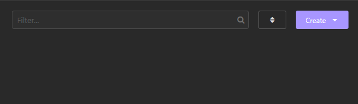

  2 - Na janela que será aberta, informe o nome da Collection e selecione `Create`
 para concluir, exemplo:

 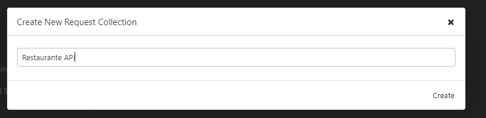

 3 - Dentro da nossa collection vamos criar uma pasta para guardar nossas requisições, selecione o botão com um símbolo de mais `(+)` e então clique em “New Folder ”, após escolha um nome para a pasta.

 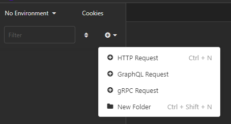

 4 -  Com a pasta criada, agora clique no simbolo na setinha e escolha a opção “New Http Request ” .

 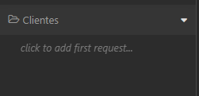

  5  -  Por padrão todas as vezes  é criado um `New Http Request` ele vêem com método padrão `GET`, mas você pode alterar o método da requisição conforme a imagem abaixo .

 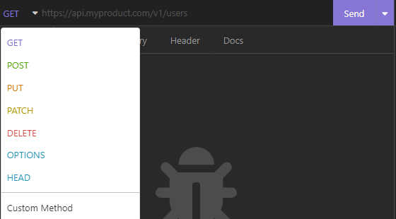

  6  -  No caso vamos usar como exemplo uma requisição utilizando o método GET, Configure a requisição conforme a imagem abaixo, para testar a requisição, com a aplicação rodando, clique no botão `Send`.

 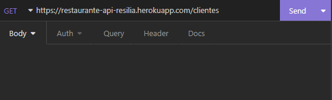

 7 - Ao clicar em “Send”, veremos o seguinte resultado no painel à direita:

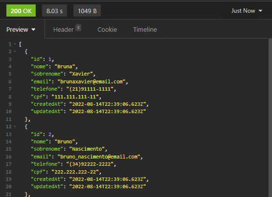

<br>

**Realize o mesmo processo anterior para testar as rotas com métodos diferentes**


### **Testando com Postman**

#### Criando uma Collection

1 - Em Collections, clique no botão `(+)`

 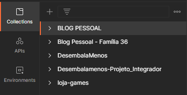

  2 -Na janela que será aberta, informe o nome da Collection e pressione a tecla enter para concluir

  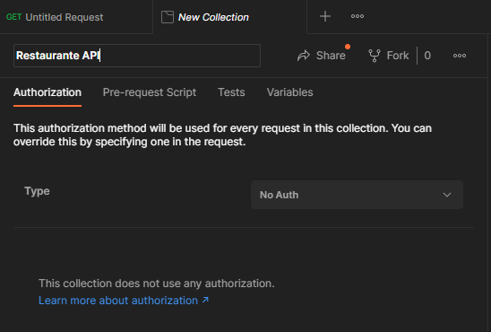

  3 - Na Collection criada, clique nos 3 pontinhos ao lado do nome da Collection para abrir o menu, Clique na opção `Add request`

  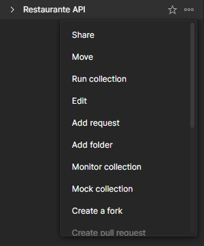

 1. Configure a requisição conforme a imagem abaixo:

 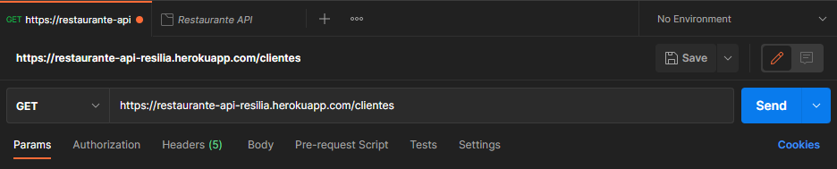

  7 - Ao clicar em “Send”, veremos o seguinte resultado na área abaixo:

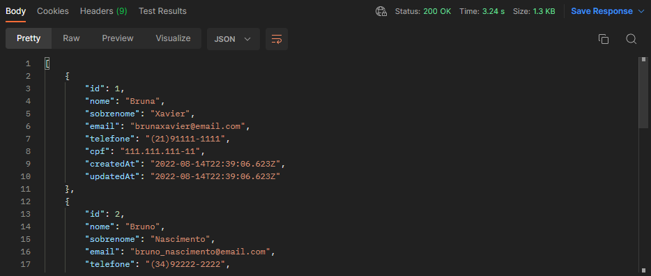
<br>

**Realize o mesmo processo anterior para testar as rotas com métodos diferentes**


### 2.3 - Rotas possíveis e métodos

1. Entidade <strong>clientes</strong>.

| Método | Rota | Descrição |
| ------ | ----- | ----------- |
| **GET** | `/clientes` | Retorna toda a tabela de clientes. |
| **GET** | `/clientes/`<strong>id | Retorna o cliente específico do id. |
| **GET** | `/clientes/pedidos/`<strong>id | Retorna todos os pedidos do cliente específico do id. |
| **POST** | `/clientes` | Popula a entidade clientes.  |
| **PUT** | `/clientes/`<strong>id | Atualiza os dados do cliente especificado no id.
| **DELETE** | `/clientes/`<strong>id | Deleta o cliente com o id especificado.
| **DELETE** | `/clientes/pedidos/`<strong>id</strong> | Deleta todos os pedidos do cliente específico do id.

<br>
2. Entidade <strong>cardápio</strong>.

| Método | Rota | Descrição |
| ------ | ----- | ----------- |
| **GET** | `/cardapios` | Retorna toda a tabela do cardápio. |
| **GET** | `/cardapios/`<strong>id | Retorna a comida específica do cardápio com o id inserido. |
| **POST** | `/cardapios` | Popula a entidade cardápios.  |
| **PUT** | `/cardapios/`<strong>id | Atualiza os dados da comida do cardápio especificado no id
| **DELETE** | `/cardapios/`<strong>id | Deleta a comida com o id especificado do cardápio.
<br>
3. Entidade <strong>bebidas</strong>.

| Método | Rota | Descrição |
| ------ | ----- | ----------- |
| **GET** | `/bebidas` | Retorna toda a tabela de bebidas. |
| **GET** | `/bebidas/`<strong>id</strong> | Retorna a bebida específica do id. |
| **POST** | `/bebidas` | Popula a entidade bebidas.  |
| **PUT** | `/bebidas/`<strong>id</strong> | Atualiza os dados da bebida especificada no id.
| **DELETE** | `/bebidas/`<strong>id</strong> | Deleta a bebida com o id especificado.
<br>
4. Entidade <strong>pedidos</strong>.

| Método | Rota | Descrição |
| ------ | ----- | ----------- |
| **GET** | `/pedidos` | Retorna toda a tabela de pedidos. |
| **GET** | `/pedidos/`<strong>id</strong> | Retorna o pedido específico do id. |
| **POST** | `/pedidos` | Popula a entidade pedidos.  |
| **PUT** | `/pedidos/`<strong>id</strong> | Atualiza os dados do pedido especifico no id.
| **DELETE** | `/pedidos/`<strong>id</strong> | Deleta o pedido com o id especificado.
<br>
5. Entidade <strong>mesas</strong>.

| Método | Rota | Descrição |
| ------ | ----- | ----------- |
| **GET** | `/mesas` | Retorna toda a tabela de mesas. |
| **GET** | `/mesas/`<strong>id</strong> | Retorna a mesa específica do id. |
| **POST** | `/mesas` | Popula a entidade mesas.  |
| **PUT** | `/mesas/`<strong>id</strong> | Atualiza os dados da mesa especifico no id.
| **DELETE** | `/mesas/`<strong>id</strong> | Deleta a mesa com o id especificado.

### 2.4 - Observações
#### 🔗 Links úteis (inglês)
- [ORM](https://blog.bitsrc.io/what-is-an-orm-and-why-you-should-use-it-b2b6f75f5e2a) → o que é ORM
- [Sequelize](https://sequelize.org/) → ORM 
- [Joi](https://joi.dev/api/) → para fazer validações de dados

## 2.5 - Requisitos do Projeto
<details> 

## 📌 1.0 - Task
- Desenvolver propostas de APIs que será o produto mínimo viável de um aplicativo.
- Definir quais são as entidades que o projeto precisa contemplar.
- Cada um dos membros do grupo será responsável por implementar uma dessas entidades.
- A entrega do projeto será feita em um repositório só.

### 1.1 - 🗝 Demandas do projeto
- [X] Utilizar os verbos HTTP seguindo o ``padrão REST``;
- [X] Implementar todas as operações de ``CRUD``;
- [X] Utilizar o padrão de projeto ``(design pattern) DAO`` para abstração de transações no banco, com Promises;
- [X] Utilizar o README.md do repositório para ``documentação``, contendo informações
como:
  - Como instalar as dependências do projeto;
  - Como executar o projeto;
  - Quais são as rotas possíveis;
  - Quaisquer outros pontos que você achar necessários;
- [X] Utilização de ``async/await`` para operações no banco (DAO)
- [X] Ter o código fonte hospedado em um repositório no Github.

### 1.2 - Extras
- [X] Hospedagem da API no Heroku;
- [X] Validação e verificação de dados (tipo e características) utilizando models;
- [X] Utilização de algum ORM ou ODM acompanhado de banco de dados de escolha.


### 1.3 - Tecnologias
 </details>

## 3. Desenvolvedores

<div align='center'>

[Bruno Nascimento](https://github.com/brunonasc74) | [Shiellyn Ferreira](https://github.com/ShiellynFerr) | [Bruna Xavier](https://github.com/bruxvr) | [Kelly Alves](https://github.com/KellySanttos) | [Artur Tolentino](https://github.com/ArturTolentino) |  
  
  ### [⬆ Voltar ao Topo](#restaurante-api)
  
  </div>
